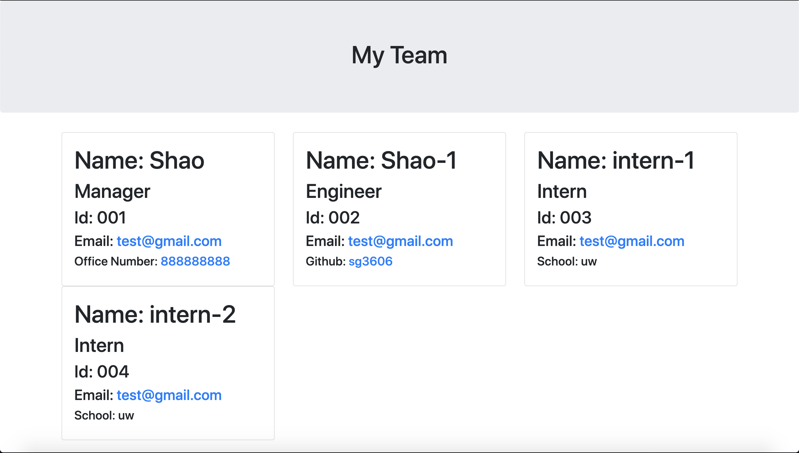

# TeamProfileGenerator
  ## Description
  This is a Node.js command-line application that takes in information about employees on a software engineering team, then generates an HTML webpage that displays summaries for each person.

  ## Table of Content
  * [Installation](#installation)
  * [Finished_Requirements](#finished_Requirements)
  * [Demo](#demo)

  ## Installation
  A command-line application that accepts user input, clone the repo and install Jest and Inquirer.

  ## Finished_Requirements
  * A command-line application that accepts user input (Manager,Engineer, and Intern)

  * An HTML file is generated that displays a nicely formatted team roster based on user input

  * Default email program opens and populates the TO field of the email with the address

  * GitHub profile opens in a new tab

  * Four tests passing

  ## Demo
  

  